# Rune Weaver

> Status: authoritative
> Audience: mixed
> Doc family: baseline
> Update cadence: on-phase-change
> Last verified: 2026-04-14
> Read when: understanding the public product boundary, target outcome, and honest current capability statement
> Do not use for: same-day execution priority, freshest blocker truth, or replacing session-sync/current-plan inputs

## 一句话定义

**Rune Weaver 是一个把自然语言功能意图转成受控游戏功能代码与可管理 feature 的系统。**

它不是任意代码生成器，也不是自由发挥型 vibe coding。它的目标是把“我想做什么功能”先结构化，再经过受控的规划、宿主落地和写入治理，最后变成可审阅、可验证、可维护的结果。

## 当前状态

**As of 2026-04-14**

- 当前唯一可信主线是 Dota2。
- 当前已经证明的是一条 Dota2 canonical skeleton+fill 路径，不是广义泛化能力。
- 整体诚实口径是：**single canonical case proven, generalization pending**。
- `Gap Fill` 已经进入真实产品化路径，不再是“未来能力”；但新鲜主机上的手动 acceptance / runtime evidence 仍未完全收口，novice-facing approval/apply 体验也还在继续打磨。
- CLI 仍是 authoritative lifecycle path。
- Workbench 目前是 orchestration / review / evidence / Gap Fill launch shell，不是 authoritative executor。
- War3 仍是 bounded secondary lane，处于 proof / skeleton-tightening / host-contract 对齐阶段，不应被描述成第二个已交付宿主。

如果你要看同日 step / blocker truth，而不是产品边界说明，请优先看 [RW-SHARED-PLAN.md](/D:/Rune%20Weaver/docs/session-sync/RW-SHARED-PLAN.md) 和 `docs/session-sync/` 下最新的 mainline note。

## Rune Weaver 到底做什么

Rune Weaver 面向的不是“吐一堆代码文件”，而是“把一个功能作为一等对象管理”：

- 接收用户的自然语言需求。
- 先把需求整理成结构化意图，而不是直接把 prompt 交给代码生成。
- 生成一个可审阅、可验证、可追踪的 feature 结果，而不是一次性的代码片段。
- 在写入前处理 ownership、governance、bridge 和 workspace state。
- 把 feature 的身份、产物和后续维护路径记录下来，支持 `create` / `update` / `delete`。
- 在 skeleton 已经固定后，为局部业务逻辑提供 **feature-scoped Gap Fill**，但仍受边界和策略控制。

## 它怎么工作

第一次提到 `Blueprint stage` 时需要说明一件事：`BlueprintProposal` 只是可选 proposal assistance，最终可执行的下游 seam 仍然是 `FinalBlueprint`。

```mermaid
flowchart LR
  A["User Request"] --> B["Wizard"]
  B --> C["IntentSchema"]
  C --> D["BlueprintProposal (optional)"]
  C --> E["BlueprintNormalizer"]
  D --> E
  E --> F["FinalBlueprint"]
  F --> G["Pattern Resolution"]
  G --> H["AssemblyPlan"]
  H --> I["HostRealizationPlan"]
  I --> J["GeneratorRoutingPlan"]
  J --> K["Generators"]
  K --> L["Write / Validation / Workspace State"]
```



- `Wizard` 负责把原始请求收敛成 `IntentSchema`，保留约束、澄清点和不确定性，而不是假装所有细节都已明确。
- `BlueprintProposal` 可以由 LLM 辅助产出候选结构，但它不是 final authority。
- `BlueprintNormalizer` 是 legality / canonicalization / policy gate。
- `FinalBlueprint` 才是 downstream 可确定性消费的 blueprint seam。
- `Pattern Resolution` 和 `AssemblyPlan` 把结构需求变成稳定的功能骨架。
- `HostRealizationPlan` 和 `GeneratorRoutingPlan` 决定怎样在具体宿主里落地，不把 host/write authority 交给 LLM。
- `Generators` 负责产生受控输出，随后进入写入、验证和 workspace state 更新。

当前 Dota2 的 `Gap Fill` 处在这条 skeleton 路径的下游。它是 **bounded refinement**，不是第二个 planner，也不是 architecture authority，更不是通用自由代码编辑系统。

## 当前已证明什么 / 尚未证明什么

| 状态 | 内容 | 说明 |
| --- | --- | --- |
| 已证明 | CLI authoritative path | Dota2 CLI 是当前可信生命周期主路径。 |
| 已证明 | workspace-backed feature management baseline | feature registry、owned artifact 记录、基础治理与 bridge 刷新已经成型。 |
| 已证明 | Dota2 canonical path | 至少一条 Dota2 canonical skeleton+fill 路径已经被收口成可重复的 acceptance 合同。 |
| 已证明 | feature-scoped Gap Fill boundary exposure | 选中的 feature 可以暴露 fill surface，并走受控的 review / apply-style path。 |
| 未证明或仍在产品化 | broader generalization | 还没有证明“更多机制类型也一样稳定”。 |
| 未证明或仍在产品化 | second canonical mechanism | 还没有第二条同等级 canonical mechanism proof。 |
| 未证明或仍在产品化 | second host shipping | War3 仍然不是 write-ready / shipped host。 |
| 未证明或仍在产品化 | `rollback` / `regenerate` as current product baseline | 这些不应被描述成当前 README-MVP 的完成项。 |
| 未证明或仍在产品化 | full Gap Fill approval/apply UX closure | 受控生命周期已在形成，但新手可理解的 approval/apply 产品闭环仍在继续打磨。 |
| 未证明或仍在产品化 | runtime/manual evidence closure | 新鲜宿主上的手动截图、视频和最终 acceptance evidence 仍未全部自动化或完全闭环。 |
| 未证明或仍在产品化 | arbitrary host-side code edit semantics | 当前 Gap Fill 仍是 downstream、bounded、policy-gated refinement，不是任意宿主代码编辑。 |

## 为什么它不是 template generator / vibe coding

| 对比点 | 常见模板生成 / vibe coding | Rune Weaver |
| --- | --- | --- |
| 最终结构 authority | 往往由 prompt 或 LLM 临场决定 | `FinalBlueprint`、Pattern、host policy 和 write path 保持 deterministic / rule-governed |
| 管理对象 | 主要是代码文件或一次性输出 | `feature` 是一等对象，带 registry、ownership、revision 和生命周期语义 |
| 写入前治理 | 常常先写再看是否冲突 | 先做 conflict / governance / ownership 判断，再进入写入 |
| Gap Fill 角色 | 容易变成自由发挥 AI glue | `Gap Fill` 是 bounded refinement，不承担 architecture authority |
| 宿主边界 | 容易直接混入宿主任意文件 | 保持 host separation，只在明确受管边界和 bridge 点内工作 |

## 当前推荐入口

CLI-first 仍然是当前真实入口。最小但真实的命令面大致如下：

```bash
npm install

npm run cli -- dota2 init --host <path>
npm run cli -- dota2 run "<request>" --host <path> --write
npm run cli -- dota2 update "<request>" --host <path> --feature <featureId> --write
npm run cli -- dota2 delete --host <path> --feature <featureId> --write
npm run cli -- dota2 gap-fill --host <path> --feature <featureId> --instruction "..." --mode review
```

补充说明：

- `dota2 run` 是当前 authoritative create path。
- `update` 和 `delete` 已经存在，但语义仍然围绕当前受控宿主边界，而不是任意语义级 refactor。
- `Gap Fill` 目前适合被理解成 post-write / post-skeleton 的业务逻辑 refinement path。
- Workbench 现在更适合承担 onboarding、review、evidence、以及 Gap Fill launch shell，而不是独立执行完整生命周期。

## War3 次要说明

War3 仍然是次线探索，不是 README 的主交付故事。它当前更接近 implementation-draft / skeleton-tightening / host-contract 对齐阶段，用来验证 Rune Weaver 的第二宿主可行性边界，而不是用来宣称“已经支持 War3 写入交付”。

## 进一步阅读

- [AGENT-EXECUTION-BASELINE.md](/D:/Rune%20Weaver/docs/AGENT-EXECUTION-BASELINE.md)
- [ARCHITECTURE.md](/D:/Rune%20Weaver/docs/ARCHITECTURE.md)
- [WIZARD-BLUEPRINT-CHAIN.md](/D:/Rune%20Weaver/docs/WIZARD-BLUEPRINT-CHAIN.md)
- [SCHEMA.md](/D:/Rune%20Weaver/docs/SCHEMA.md)
- [DEMO-PATHS.md](/D:/Rune%20Weaver/docs/DEMO-PATHS.md)
- [RW-SHARED-PLAN.md](/D:/Rune%20Weaver/docs/session-sync/RW-SHARED-PLAN.md)

如需阅读 [CURRENT-STATE-VS-TARGET.md](/D:/Rune%20Weaver/docs/CURRENT-STATE-VS-TARGET.md)，请只把它当作 `planning-only` narrative comparison，不要把它当作当前执行真相。
