# Rune Weaver

> Status: authoritative
> Audience: mixed
> Doc family: baseline
> Update cadence: on-phase-change
> Last verified: 2026-04-25
> Read when: understanding the public product boundary, current Dota2 capability, and the governed feature-generation model
> Do not use for: same-day execution priority, freshest blocker truth, or replacing session-sync/current-plan inputs

## 一句话定义

**Rune Weaver 是一个把自然语言 feature 意图转成受治理、可验证、可维护游戏代码的系统。**

它追求的不是“让模型随便生成一点代码”，而是把一个 feature 作为一等对象管理：

- 有稳定 `featureId`
- 有 owned files 和 bridge 入口
- 有 create / update / regenerate / delete / repair 的生命周期
- 有 feature 间依赖、治理状态、grounding 与 review truth
- 有 workspace truth、bridge projection 和 product-facing governance read-model

## 当前状态

**As of 2026-04-25**

- 当前唯一可信主线仍是 Dota2。
- Dota2 主线当前处于 **Step 7: Productization / UX bridge**。
- Dota2 已完成 V2 governance-first 控制面，并把 product surfaces 收口到 **read-model-first**：
  - bridge export 带 root-level `governanceReadModel`
  - connected-host status 在有 workspace 时返回 `governanceReadModel`
  - workbench / inspect / doctor wording 优先消费同一投影，而不是各自推导 lifecycle truth
- compatibility-only fallback 仍存在，但只服务旧 bridge / raw workspace / old host-status / legacy workbench-result payload，且只允许作为 **legacy display boundary**。
- `export-bridge` 是唯一 stale payload refresh lane。
- CLI 仍是 authoritative lifecycle path。
- Workbench 仍是 product entry / orchestration / review shell，不是 lifecycle authority。
- War3 仍是 bounded secondary lane，不应被描述成 write-ready 第二宿主。

如果你需要同日 step / blocker truth，请优先看 [RW-SHARED-PLAN.md](/D:/Rune%20Weaver/docs/session-sync/RW-SHARED-PLAN.md) 和 `docs/session-sync/` 下最新的 mainline note。

## 当前主链

当前接受的 Dota2 主链是：

```mermaid
flowchart LR
  A["User Request"] --> B["Wizard"]
  B --> C["IntentSchema / Clarification Signals"]
  C --> D["Blueprint Stage"]
  D --> E["Pattern / Family Resolution"]
  E --> F["AssemblyPlan"]
  F --> G["HostRealizationPlan"]
  G --> H["GeneratorRoutingPlan"]
  H --> I["WritePlan"]
  I --> J["LocalRepair (bounded)"]
  J --> K["Write Executor"]
  K --> L["Host / Runtime Validation"]
  L --> M["Final Commit Decision"]
  M --> N["Workspace Lifecycle Update"]
  N --> O["Governance Read-Model Projection"]
```



这里有几条当前 baseline：

- 最终 authority 不是 Stage 1 语义姿态，也不是单个 UI surface 的 ready/weak 命名，而是链路末尾的 **final commit decision** 与后续 canonical workspace truth。
- clarification 只负责 observation/signals；真正的 blocking authority 由 Blueprint 之后的 execution authority 决定。
- family 和 pattern 是 **reusable governance truth**，不是 prompt 级 mechanic allowlist。
- 未命中 family / pattern 的 ask，不应因为 catalog 没见过就被判死；它应进入 honest `guided_native` 或 `exploratory` 路径，并保留 review truth。
- `blocked` 的含义收紧到 ownership / safety / host-impossible / unresolved dependency / validation-failure。

## Dota2 已落地的关键边界

### Create / Update / Regenerate / Delete / Repair

- CLI 支持：
  - `create` / `run`
  - `update`
  - `regenerate`
  - `rollback` / delete-style maintenance
  - `repair`
  - `doctor`
  - `validate`
  - `export-bridge`
- exploratory / guided-native 输出不再把 synthetic `dota2.exploratory_ability` 当主实现语义；当前主语义是 **ArtifactSynthesis + bounded LocalRepair + final commit gate**。
- `gap-fill` 仍保留兼容命令名，但当前产品语义已经降位为 **repair alias / bounded local repair / muscle fill**。

### Workbench / Bridge / Connected Host

- Workbench 是当前产品入口与 review shell：
  - 它可以消费 bridge artifact
  - 它可以消费 connected-host live status
  - 它优先显示 `governanceReadModel`
- bridge artifact 现在是 governed payload：
  - root-level `governanceReadModel`
  - `_bridge` metadata
  - workspace snapshot
- connected-host live path 也优先走 read-model-first：
  - `/api/host/status -> useHostScanner -> useFeatureStore -> workspaceAdapter`
  - 未请求 live observation 时，`repairability = not_checked` 是 honest 状态，不是缺数据

### Compatibility / Refresh 边界

- compatibility-only fallback 只允许输出 display-safe 信号：
  - persisted feature status
  - legacy warning / source warning
  - `repairability = not_checked`
  - neutral summary text
- compatibility-only fallback 不能输出：
  - `clean`
  - `committable`
  - admitted reusable assets
  - grounding trust / quality
  - readiness score
- stale payload refresh 只走：

```bash
npm run cli -- export-bridge --host <path> [--output <dir>]
```

- `doctor` / `validate` / `repair` / connected-host status / manual JSON editing 都不是 refresh lane。

### 当前已证明的 create front-door 边界

- 显式 choose-one 的本地 weighted-selection ask 不再默认走 wizard-by-default。
- `selection_pool` 现在允许：
  - feature-owned pool membership
  - `external_catalog` object truth
  - honest external catalog-backed equipment/native-item path
- `equipment` 通过 catalog-backed `selection_pool` path 闭合，而不是靠 case 特判或 exploratory fallback。
- ambiguous weighted-card prompt 仍会被 honest clarification 卡住，不会偷写成 generic synthesized micro-feature。

## 当前诚实能力边界

当前 Dota2 baseline 可以诚实地说：

- workspace 是 feature registry、lifecycle truth 与 governance persistence surface
- feature record 已持久化：
  - `maturity`
  - `implementationStrategy`
  - `featureContract`
  - `dependencyEdges`
  - `validationStatus`
  - `commitDecision`
  - grounding summary
- templated 路径仍是稳定主路
- exploratory / guided-native 路径可以生成 host-owned Lua / KV / UI candidate artifacts
- bridge / CLI / workbench / connected-host 可以消费统一的 governance read-model
- reveal/provider 的 governance truth、seam admission、grounding recovery、stale-host upgrade proof 已落地到控制面

当前还不能诚实宣称的内容：

- exploratory 输出已经“无需 review”
- compatibility fallback 可以代表治理真相
- `export-bridge` 之外存在第二条 legacy payload refresh lane
- governance read-model 已经 host-agnostic，可以安全上抬到 `core/**`
- War3 已经是 write-ready host

## 产品边界

Rune Weaver 当前只拥有：

- `game/scripts/src/rune_weaver/**`
- `game/scripts/vscripts/rune_weaver/**`
- `content/panorama/src/rune_weaver/**`
- 明确允许的 bridge points

允许的 bridge points：

- `game/scripts/src/modules/index.ts`
- `content/panorama/src/hud/script.tsx`

Rune Weaver 不拥有：

- arbitrary host files
- user business code
- undeclared cross-feature writes

## 当前推荐入口

authoritative lifecycle path 仍是 CLI：

```bash
npm install
npm run cli -- dota2 run "<request>" --host <path> --write
npm run cli -- dota2 update "<request>" --host <path> --feature <featureId> --write
npm run cli -- dota2 regenerate "<request>" --host <path> --feature <featureId> --write
npm run cli -- dota2 rollback --host <path> --feature <featureId> --write
npm run cli -- dota2 repair --host <path>
npm run cli -- dota2 repair --host <path> --safe
npm run cli -- dota2 doctor --host <path>
npm run cli -- dota2 validate --host <path>
npm run cli -- export-bridge --host <path>
```

补充说明：

- review artifact 是当前链路的一部分，不是可选附属物。
- exploratory / guided-native 输出默认仍带 `requiresReview=true`。
- Workbench 是产品入口、观察面和证据面，但不是 lifecycle authority。
- connected host 和 bridge sample 都优先读 `governanceReadModel`；compatibility-only 只保留给 legacy payload。

## 进一步阅读

- [AGENT-EXECUTION-BASELINE.md](/D:/Rune%20Weaver/docs/AGENT-EXECUTION-BASELINE.md)
- [ARCHITECTURE.md](/D:/Rune%20Weaver/docs/ARCHITECTURE.md)
- [WORKSPACE-MODEL.md](/D:/Rune%20Weaver/docs/WORKSPACE-MODEL.md)
- [WIZARD-BLUEPRINT-CHAIN.md](/D:/Rune%20Weaver/docs/WIZARD-BLUEPRINT-CHAIN.md)
- [LLM-INTEGRATION.md](/D:/Rune%20Weaver/docs/LLM-INTEGRATION.md)
- [DOTA2-V2-GOVERNANCE-FIRST-ARCHITECTURE.md](/D:/Rune%20Weaver/docs/hosts/dota2/DOTA2-V2-GOVERNANCE-FIRST-ARCHITECTURE.md)
- [RW-SHARED-PLAN.md](/D:/Rune%20Weaver/docs/session-sync/RW-SHARED-PLAN.md)
