# Rune Weaver

> Status: authoritative
> Audience: mixed
> Doc family: baseline
> Update cadence: on-phase-change
> Last verified: 2026-04-18
> Read when: understanding the public product boundary, current Dota2 capability, and the governed feature-generation model
> Do not use for: same-day execution priority, freshest blocker truth, or replacing session-sync/current-plan inputs

## 一句话定义

**Rune Weaver 是一个把自然语言 feature 意图转成受治理、可验证、可维护游戏代码的系统。**

它追求的不是“随便生成一点代码”，而是把一个 feature 作为一等对象管理：

- 有稳定 `featureId`
- 有 owned files 和 bridge 入口
- 有更新、重生成、删除的生命周期
- 有 feature 间依赖与验证状态
- 有 review artifact 和 workspace truth

## 当前状态

**As of 2026-04-18**

- 当前唯一主线仍是 Dota2。
- Dota2 主线已经 ratify 到 **V2 governance-first** 语义。
- 当前主链支持：
  - `create`
  - `update`
  - `regenerate`
  - `delete`
  - `rollback` maintenance command
- 当前 exploratory / guided-native 路径不再把 synthetic `dota2.exploratory_ability` 当成主实现；新主语义是 **ArtifactSynthesis + LocalRepair + final commit gate**。
- `gap-fill` 仍保留兼容命令名，但当前产品语义已经降位为 **bounded local repair / muscle fill**。
- CLI 仍是 authoritative lifecycle path。
- Workbench 仍是 orchestration / review / evidence shell，不是 authoritative executor。
- War3 仍是 bounded secondary lane，不应被描述成 write-ready 第二宿主。

如果你需要同日 step / blocker truth，请优先看 [RW-SHARED-PLAN.md](/D:/Rune%20Weaver/docs/session-sync/RW-SHARED-PLAN.md) 和 `docs/session-sync/` 下最新的 mainline note。

## 核心工作流

当前接受的主链是：

```mermaid
flowchart LR
  A["User Request"] --> B["Wizard"]
  B --> C["IntentSchema"]
  C --> D["Blueprint Stage"]
  D --> E["Pattern Retrieval / Strategy Selection"]
  E --> F["AssemblyPlan"]
  F --> G["HostRealizationPlan"]
  G --> H["GeneratorRoutingPlan"]
  H --> I["WritePlan"]
  I --> J["LocalRepair (bounded)"]
  J --> K["Write Executor"]
  K --> L["Host / Runtime Validation"]
  L --> M["Final Commit Decision"]
  M --> N["Workspace Lifecycle Update"]
```



这里有几条当前 baseline：

- Blueprint 内部可以使用 `DesignDraft`、`FeatureContract`、`FeatureDependencyEdge`、阶段性 `commitDecision`，但外部公开名字仍保持 `IntentSchema` / `Blueprint` / `FinalBlueprint`。
- family 和 pattern 是 **reuse asset**，不是 mechanic admission gate。
- 未命中 family / pattern 的 ask，不应该因为 catalog 没见过就被判死；它应该进入 `guided_native` 或 `exploratory`。
- `blocked` 的含义已经收紧到 ownership / safety / host-impossible / dependency-breakage / validation-failure。
- 最终 authority 不是 blueprint 的 `ready | weak | blocked`，而是链路末尾的 **final commit decision**。

## Blueprint、Pattern、Family、Repair 各自做什么

- `Blueprint`
  - 决定 feature 结构、owned scope、dependency contract、strategy 选择
- `Family`
  - 提供可重复 feature 类别的 skeleton
- `Pattern`
  - 提供可复用机制 tactics 和 host binding
- `ArtifactSynthesis`
  - 在 target surfaces 已固定后，为 guided-native / exploratory 路径生成 owned candidate artifacts
- `LocalRepair`
  - 只在 `fillContracts` / owned scope 内做 bounded patch 和 muscle fill

Rune Weaver 的原则是：

- hard-code **how features are governed**
- do not hard-code **all mechanics they are allowed to attempt**

## 当前已证明的能力边界

当前 Dota2 baseline 可以诚实地说：

- workspace 是 feature registry 和 lifecycle truth
- feature record 已持久化：
  - maturity
  - implementationStrategy
  - featureContract
  - dependencyEdges
  - validationStatus
  - commitDecision
- templated 路径仍是稳定主路
- exploratory / guided-native 路径可以生成 host-owned Lua/KV/UI candidate artifacts
- repair 已经降位成 bounded local repair，而不是 primary generation model
- dependency-driven revalidation 已接入 declared contracts
- create / update / regenerate / delete 不再只靠 prompt 文本做跨 feature 推断

当前还不能诚实宣称的内容：

- broad mechanic generalization 已经被大规模 runtime 证明
- exploratory 输出已经“无需 review”
- War3 已经是 write-ready host

## 产品边界

Rune Weaver 当前只拥有：

- `game/scripts/src/rune_weaver/**`
- `game/scripts/vscripts/rune_weaver/**`
- `content/panorama/src/rune_weaver/**`
- 明确允许的 bridge points

允许的 bridge points：

- `game/scripts/src/modules/index.ts`
- `content/panorama/src/hud/script.tsx`

Rune Weaver 不拥有：

- arbitrary host files
- user business code
- undeclared cross-feature writes

## 当前推荐入口

CLI 仍是真实入口：

```bash
npm install
npm run cli -- dota2 run "<request>" --host <path> --write
npm run cli -- dota2 update "<request>" --host <path> --feature <featureId> --write
npm run cli -- dota2 regenerate "<request>" --host <path> --feature <featureId> --write
npm run cli -- dota2 delete --host <path> --feature <featureId> --write
npm run cli -- dota2 repair --host <path> --feature <featureId> --instruction "..."
```

补充说明：

- `dota2 gap-fill` 仍可运行，但现在只是 `repair` 的兼容 alias。
- exploratory / guided-native 输出默认带 `requiresReview=true`。
- review artifact 是当前链路的一部分，不是可选附属物。

## 进一步阅读

- [AGENT-EXECUTION-BASELINE.md](/D:/Rune%20Weaver/docs/AGENT-EXECUTION-BASELINE.md)
- [ARCHITECTURE.md](/D:/Rune%20Weaver/docs/ARCHITECTURE.md)
- [WORKSPACE-MODEL.md](/D:/Rune%20Weaver/docs/WORKSPACE-MODEL.md)
- [WIZARD-BLUEPRINT-CHAIN.md](/D:/Rune%20Weaver/docs/WIZARD-BLUEPRINT-CHAIN.md)
- [LLM-INTEGRATION.md](/D:/Rune%20Weaver/docs/LLM-INTEGRATION.md)
- [DOTA2-V2-GOVERNANCE-FIRST-ARCHITECTURE.md](/D:/Rune%20Weaver/docs/hosts/dota2/DOTA2-V2-GOVERNANCE-FIRST-ARCHITECTURE.md)
- [RW-SHARED-PLAN.md](/D:/Rune%20Weaver/docs/session-sync/RW-SHARED-PLAN.md)
