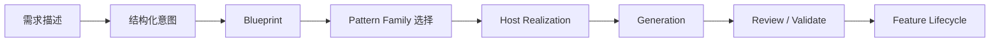

> Status: active-reference
> Audience: humans
> Doc family: baseline
> Update cadence: on-phase-change
> Last verified: 2026-04-15
> Read when: explaining Rune Weaver to AI product managers, external collaborators, or non-technical stakeholders
> Do not use for: same-day execution priority, blocker truth, or superseding README's current capability boundary

# Rune Weaver 产品集介绍（给 AI 产品经理）

## 一句话定位

**Rune Weaver 是一个受约束的 Feature Construction Platform。**

它要解决的不是“让模型多写一点代码”，而是把一句自然语言需求，稳定地转成一个可审阅、可验证、可维护、可继续演进的功能单元。

它不是聊天式代码生成器，也不是更花哨的 vibe coding。它更像一条受控的产品化功能生产线。

## 这份文档给谁看

这份文档面向：

- AI 产品经理
- 产品 owner
- 需要快速理解 Rune Weaver 的外部协作者
- 不准备直接读实现代码，但需要理解产品边界和工作方式的人

它的任务是解释 Rune Weaver 的产品定位、工作流和方法论。

它**不是**当前执行队列，也**不是**最新 blocker 看板。当前能力边界与诚实状态以 [README.md](/D:/Rune%20Weaver/README.md) 为准；同日主线 truth 以 session-sync 与 current plan 为准。

## 术语表

| 术语 | 产品语言解释 |
| --- | --- |
| `Feature` | Rune Weaver 管理的基本单位。它不是一堆散落文件，而是一个可以被创建、更新、验证、删除、追踪责任边界的功能。 |
| `Host` | 功能最终落地的真实项目环境，例如某个具体游戏宿主或工程。 |
| `IntentSchema` | 把用户的自然语言需求整理成结构化意图的结果。它的作用不是生成代码，而是把“真正想做什么”讲清楚。 |
| `FinalBlueprint` | 经过规范化和约束校验后的确定性结构描述。它告诉系统“这个功能应该由哪些结构组成”，但不直接决定具体写哪段宿主代码。 |
| `ModuleNeed` | 对某个功能子模块的能力需求描述。它表达“需要什么能力”，而不是提前指定“必须用哪个 pattern”。 |
| `Pattern` | 一类可复用的实现模式。它不是单个 case 的硬编码，而是可重复服务一类机制需求的结构单元。 |
| `Generator` | 根据已确定的结构和落地路径，产出宿主代码、配置或桥接产物的组件。 |
| `Gap Fill` | 在既定骨架内做边界受控的补全。它用于填充已声明的可变部分，不负责重新定义整体架构。 |
| `authoritative path` | 当前被视为真实可信的执行主路径。现在它更多指 CLI 这条受控生命周期路径，而不是任意界面入口。 |

## Rune Weaver 产品集总览

如果从 AI 产品经理的视角看，Rune Weaver 不是一个单点工具，而是一套围绕“功能被如何生产和治理”组织起来的产品集。

它大致由六层能力组成：

1. 需求理解层  
   负责接收用户描述，识别目标功能、约束、状态、触发条件和缺失信息。

2. 结构化规划层  
   负责把自然语言需求整理成 `IntentSchema`，再规范化为可审阅的 `FinalBlueprint`。

3. 模式选择层  
   负责根据 `ModuleNeed` 选择合适的 pattern family，而不是靠 case 名称或临时 prompt 习惯做决定。

4. 宿主落地层  
   负责决定这个功能如何在具体宿主中实现，保持宿主边界、桥接点和写入治理清晰。

5. 生成与验证层  
   负责生成产物、进行 review / apply / validate，并确保结果不是“看起来像写完了”，而是真的进入可管理状态。

6. 生命周期管理层  
   负责让功能可以持续 update、delete、验证冲突、保留 ownership，并支持后续 bounded gap fill。

`CLI`、`Wizard`、`Workbench` 在这里更像不同入口和交互表面：

- `CLI` 是当前 authoritative path
- `Wizard` 是结构化理解入口
- `Workbench` 是 orchestration / review / evidence shell

它们都不是产品本体。产品本体是这条 feature-first 的受控构建链路。

## Feature-first 工作流

Rune Weaver 的核心理念不是“先写文件”，而是“先生产和治理 feature”。

可以用一个轻量例子来理解：  
用户想做一个成长功能，要求玩家在特定时机看到 3 个候选项，从中选 1 个，选择结果要影响后续状态，并在界面上持续反馈。

在 Rune Weaver 里，这个流程不是“把这句话直接扔给模型，然后看看它会改哪些文件”，而是：

1. 用户描述目标功能  
   先说清楚功能目标、触发方式、状态变化、限制条件、需要接入哪些现有系统。

2. 系统提炼结构化意图  
   把自然语言整理成 `IntentSchema`，区分已知信息、待澄清信息和不能假装知道的部分。

3. 形成可审阅结构  
   把意图转成 `FinalBlueprint`，明确这个功能需要哪些模块和能力，而不是先决定生成哪段代码。

4. 选择合适的 pattern family  
   根据 `ModuleNeed` 选择适配的实现模式，保证选择依据来自能力需求，而不是某个历史 case。

5. 生成受控宿主输出  
   进入 host realization、generator routing 和生成过程，只在受管边界和桥接点中落地。

6. 进入 review / apply / validate  
   在真正写入前后检查冲突、ownership、结果合法性和验证状态。

7. 继续管理这个 feature  
   后续如果要 update、delete 或对已声明的可变部分做 bounded gap fill，系统仍然围绕同一个 feature 管理，而不是重新从零写一遍。

所以，Rune Weaver 真正管理的是：

- 这个功能是什么
- 它由哪些结构组成
- 它应该落到哪个宿主边界里
- 它是否与已有功能冲突
- 它之后如何继续演进

而不是“本轮模型碰巧改了哪几个文件”。

## 为什么它不是 vibe coding

Rune Weaver 和 vibe coding 的区别，不在于界面是不是聊天框，而在于系统把什么当成第一等对象。

| 对比点 | 常见 vibe coding | Rune Weaver |
| --- | --- | --- |
| 工作对象 | 文件、代码片段、一次性 patch | `feature` 及其生命周期 |
| 工作方式 | prompt 直接驱动生成 | 先结构化意图，再受控落地 |
| 结果形态 | 先写出来，再回头判断影响 | 先判断边界、ownership、冲突，再进入写入 |
| 变更演进 | 常常退化成“再改一遍” | 支持 create / update / delete / bounded refinement |
| 风险暴露 | 冲突常在后期暴露 | 通过治理、review、validate 尽量前置暴露 |

这不是说 vibe coding 没价值。

相反，二者更像适用场景不同：

- 如果目标是快速试一个点子、写一个一次性脚本、临时修一小段代码，vibe coding 往往更直接。
- 如果目标是在一个持续演进的真实项目里稳定地增加第 N 个功能、更新旧功能、避免功能之间互相污染，Rune Weaver 的价值才会变得明显。

换句话说，Rune Weaver 不是为了替代一切生成工具，而是为了把“功能持续演进”这件事做成一个可治理的产品流程。

## 如何保证泛化能力

Rune Weaver 追求的泛化，不是“遇到一个新 case 就补一段产品代码”，而是让更多需求落在同一套受支持的机制语法和受控结构上。

先用一句最重要的人话说清楚：

- `Blueprint / Pattern / Routing` 负责的是**骨架泛化**
- `Gap Fill` 负责的是**骨架确定之后的实现变体泛化**

也就是说，Rune Weaver 希望先回答：

- 这是不是同一种功能骨架
- 它需要哪些模块
- 模块之间怎么连接
- 它该落到宿主的哪类路径里

这些问题一旦回答清楚，后面“具体怎么抽”“具体怎么映射效果”“界面文案怎么呈现”“某些局部规则怎么特化”，才交给 `Gap Fill` 去补。

你可以把它理解成：

- 前半段系统负责决定“这是一辆什么车，底盘怎么搭，发动机装哪，刹车和方向盘怎么接”
- `Gap Fill` 负责决定“同一类车里的调校细节、内饰和局部部件怎么配”

如果底盘都还没搭好，就不该靠 `Gap Fill` 临场焊一辆新车。

这套泛化路径主要依赖七件事：

1. 受支持的 mechanic grammar  
   先定义系统准备覆盖哪些语义家族，例如触发、计时、刷出、状态、选择、成长、资源、效果、UI 反馈、集成桥接。

2. 结构化 `IntentSchema`  
   让用户需求先被表达成语义，而不是只留下几句薄弱摘要。

3. deterministic `FinalBlueprint`  
   让下游消费的是规范化后的结构对象，而不是每次都重新猜测需求。

4. canonical `ModuleNeed`  
   让 pattern 选择依据变成“需要什么能力”，而不是“上次这个 case 用了什么名字”。

5. capability-fit-first 的 pattern resolution  
   优先按能力、输出、状态预期和集成要求匹配 pattern，而不是靠 raw pattern id 或 hint 主导。

6. family-first 的 realization / routing  
   让宿主落地和生成路径围绕通用 family 组织，而不是每来一个机制就长一条特判分支。

7. unsupported request 的 honest block  
   当需求超出当前 grammar 或能力覆盖时，系统应该明确阻塞并说明缺口，而不是假装支持然后写出脆弱结果。

### 一个更具体的理解方式

如果两个需求本质上共享同一套功能骨架，那么 Rune Weaver 理想上不应该为它们各自重建一遍 `Blueprint / Pattern / Routing`。

例如：

- 天赋抽取
- 装备抽取

它们在很多情况下，本质上都可能属于同一类骨架：

- 有一个触发入口
- 系统准备一组选项
- 玩家从若干候选里选一个
- 选择结果要写回当前状态
- 结果要同步到 UI

如果只是这样，那么它们的**骨架**其实很接近：

- 需要候选池
- 需要选择流程
- 需要确认提交
- 需要结果应用
- 需要状态同步
- 需要界面反馈

这时真正应该复用的是：

- `IntentSchema` 如何表达这个需求
- `FinalBlueprint` 如何把它编译成稳定结构
- `ModuleNeed` 如何描述它需要的能力
- `Pattern` 如何承接这类“候选生成 + 玩家选择 + 结果提交”的功能家族
- `Routing` 如何把它稳定送进正确的宿主输出路径

而 `Gap Fill` 在这里起的作用，不是重新定义骨架，而是负责这些局部特化：

- 候选项从哪里来
- 候选项怎么抽
- 是否允许重复
- 稀有度或权重规则怎么定
- 选中后到底应用什么效果
- UI 上是显示“天赋卡”还是“装备卡”
- 状态同步里带哪些展示字段

### 天赋抽取 vs 装备抽取：同骨架下的不同特化

可以把它想成“同一套抽取与选择骨架，不同的业务特化”。

以一个很简化的例子来说：

#### 天赋抽取

骨架层可能表达的是：

- 玩家按某个键或在某个时机打开选择界面
- 系统给出 3 个候选
- 玩家选 1 个
- 选择结果写回玩家当前成长状态
- UI 显示当前选择与结果

这时 `Gap Fill` 可能补的是：

- 候选池按稀有度如何抽
- 已拿过的天赋是否从池里移除
- “力量提升”“敏捷提升”“全属性提升”具体映射到什么效果
- 卡片标题、副标题、badge 怎么显示

#### 装备抽取

如果它仍然是：

- 给 3 个候选装备
- 玩家选 1 个
- 结果进入当前局内状态
- UI 反馈当前装备结果

那它仍然可能沿用同一套骨架。

这时 `Gap Fill` 特化的就会变成：

- 候选池是按装备品类还是稀有度抽
- 已获得装备能不能再次出现
- 选中装备后是直接加属性、解锁被动，还是进入待装备状态
- UI 展示的是图标、装备槽位还是效果说明

换句话说：

- **骨架没有变**
- **变的是骨架内部的业务内容**

这正是 `Gap Fill` 应该发挥作用的地方。

### 它有没有足够的灵活度

答案是：

- 对“同一类玩法骨架里的多个业务变体”，`Gap Fill` 应该有相当高的灵活度
- 但对“已经变成另一种结构”的需求，`Gap Fill` 不应该硬兜

继续用上面的例子：

如果“装备抽取”只是把“天赋抽取”的候选内容从天赋换成装备，那它很可能还是同一套骨架。

但如果装备系统开始要求：

- 装备槽位冲突
- 替换与卸下逻辑
- 背包上限
- 合成路径
- 出售与分解
- 与商店 / 掉落 / 经济系统联动

那它就很可能已经不再只是“同一个抽取骨架的业务变体”，而是在往新的功能骨架走了。

这时正确做法不是继续让 `Gap Fill` 越权变大，而是回到上游：

- 重新检查 grammar 是否覆盖
- 重新检查 `Blueprint` 是否需要更丰富的结构表达
- 重新检查 `Pattern` family 是否要扩展
- 重新检查 `Routing / Realization` 是否需要新的稳定路径

所以，判断标准不是“这是不是另一个 case”，而是：

- 这是同一套骨架里的局部特化
- 还是已经变成需要新骨架支持的功能

在这套方法里，case 的作用很明确：

- case 用来验证这套 generalized core 是否真的覆盖到某个机制组合
- case 不应该反过来成为架构的唯一驱动器

所以，Rune Weaver 的泛化能力不是“支持了多少 demo”，而是“多少需求可以在不新增产品代码的前提下，落到已声明支持的 grammar 与 pattern family 上”。

## 对 AI 产品经理意味着什么

如果你是 AI 产品经理，Rune Weaver 最适合的提需求方式不是一句模糊愿望，而是尽量把下面几类信息讲清楚：

- 这个 feature 的目标 outcome 是什么
- 它由什么触发
- 它会引入哪些状态或资源变化
- 它有哪些必须成立的不变量
- 它要接入哪些现有系统、界面或桥接点
- 哪些地方允许变化，哪些地方不允许

更接近好输入的表达是：

- “玩家在某个事件后进入一个持续存在的选择状态，系统给出若干候选项，选择结果影响后续资源与状态，并需要在 UI 中持续展示当前效果。”

而不是：

- “给我做一个很酷的成长系统，最好顺便都接好。”

同时也要有一个合理预期：

- Rune Weaver 不是“任何一句话都能直接变成任意复杂游戏系统”
- 它更像一个把需求转成受控功能结构的产品化系统
- 当需求超出当前支持边界时，理想表现是 honest block，而不是假装全能

## 当前诚实边界

截至当前公开口径，Rune Weaver 的边界应与 [README.md](/D:/Rune%20Weaver/README.md) 保持一致：

- Dota2 是当前唯一可信主线
- CLI 仍是 authoritative path
- Workbench 不是独立执行权威
- War3 仍是次线探索，不应被描述成已稳定交付宿主
- 整体仍在推进泛化能力，不应宣传成“任意需求都已全面支持”

这也是这份文档与 README 的分工：

- [README.md](/D:/Rune%20Weaver/README.md) 负责当前产品边界与诚实能力声明
- 本文档负责解释产品方法论、工作流和 feature-first 逻辑
- session-sync / current plan 负责同日执行 truth，不由本文档承担

## 进一步阅读

- [README.md](/D:/Rune%20Weaver/README.md)
- [ARCHITECTURE.md](/D:/Rune%20Weaver/docs/ARCHITECTURE.md)

如果你要理解 Rune Weaver 今天到底已经交付到哪里，请先读 README。  
如果你要理解 Rune Weaver 为什么这样设计、为什么它强调 feature-first 和受控泛化，再回来看这份文档。
